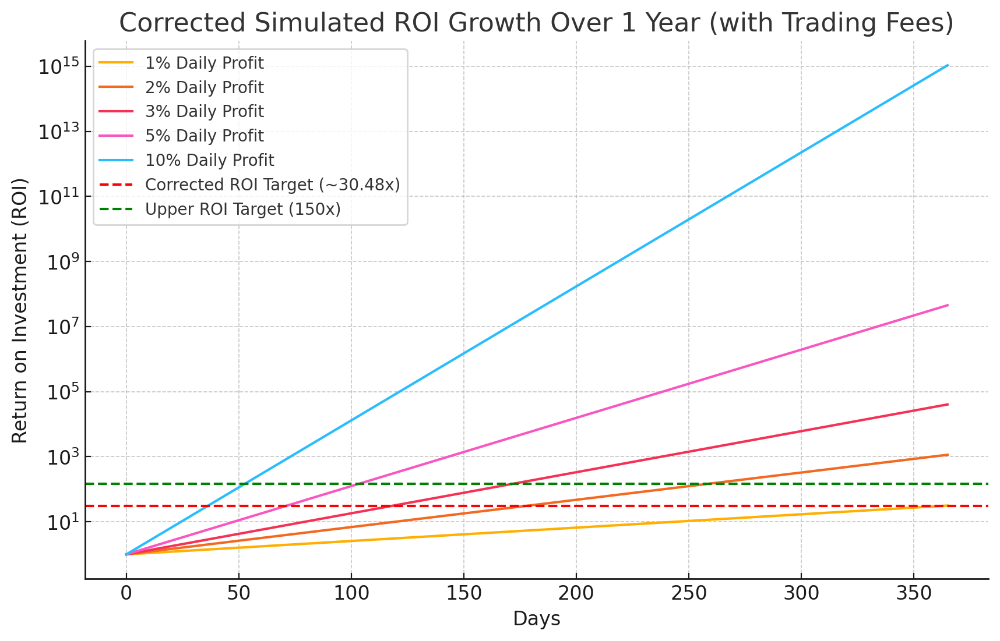

# THE GLITCH
## 1. Problem Statement
Achieve a high-frequency trading algorithm that generates the highest possible ROI (~30.48x and above yearly, or 1% and above daily), using the Binance trading platform and the BTC/USDC pair.

## 2. ROI Formula
X*(n^d)*(1 - ϕ/2)^d, where:
- **X** = Initial sum
- **n** = Percent daily profit
- **d** = Number of days the algorithm is running
- **ϕ** = Trading fee per trade 

Since a profit is realized only after a buy and sell cycle, each cycle incurs **two fees**, effectively making the net deduction per cycle **0.2%** if each trade costs 0.1%.

#### Example: 
For "n" = 1.01 (1%) and "d" = 365, and "ϕ" = 0.001 (0.1% trading fee):

ROI = 1 * (1.01^365) * (1 - 0.001/2)^365  
= ~30.48x of the invested initial sum.  

Some backtesting shows up to a 150x/year, but take it with a grain of salt.

## 3. Why 1% Daily Profit is the Bare Minimum
Given the following trading conditions:
- **Exchange**: Binance
- **Trading Pair**: BTC/USDC
- **Trading Fee**: 0.1% per trade (applies on both buy and sell)
- **Trading Strategy**: spot, 100% of portfolio/equity allocated on each trade

A 1% stable daily profit is the bare minimum for the following reasons:

1. **Fee Impact:**
   - Each trade incurs a **0.1% fee** on both entry and exit. This results in a **total cost of 0.2% per trade** cycle. Therefore, achieving less than **0.2% net gain** would result in net-zero or negative returns.
   - A 1% daily gain ensures that even after deducting fees, the system still achieves **0.8% net profit per trade**.

2. **Market Noise and Execution Risk:**
   - Crypto markets are volatile, and small gains can be easily erased by sudden price swings or slippage. A 1% profit margin allows a buffer to absorb such fluctuations.

3. **Compounding Needs:**
   - To achieve your ~30.48x yearly ROI goal, a daily gain of **~1.01x** is necessary. Lower daily targets (e.g., 0.5%) would only compound to around **6x** over a year, far below the objective.

4. **Risk Management:**
   - The 1% threshold provides enough margin to counteract inevitable losing trades. If some trades incur small losses, maintaining a 1% target helps sustain long-term profitability.

## 4. Simulated ROI Growth Over 1 Year
The graph below illustrates simulated ROI growth for different daily profit rates, showing that achieving 1% stable daily growth is critical for hitting the desired ROI target.

**Legend:**
- **Red Line** — Corrected ROI Target of **~30.48x** (Minimum Goal)
- **Green Line** — Upper Target ROI of **150x** (Ambitious Goal)

**Legend:**
- **Red Line** — Target ROI of **40x** (Minimum Goal)
- **Green Line** — Upper Target ROI of **150x** (Ambitious Goal)

The chart reveals that:
- At **1% daily profit**, the ROI nears ~30.48x.
- Higher profit rates (e.g., 2% or 3%) push ROI dramatically beyond 150x, though maintaining such rates consistently may be unrealistic.

## 5. Solution
### Damped Harmonic Oscillators
In a world where everybody is trying to find the next big thing, I decided to use a combination of historical pricing data and news interpretation to achieve a profitable algorithm. My proposed algorithm identifies:
1. the best buy/sell signals in historical data (let's call them pivots);
2. the impact/importance, period of impact and decay of a news headline.

The algorithm then compares the two. Since all historical analysis is unapplicable in a live environment, I use a Supervised Reinforcement Learning algorithm to emulate the historical behaviour, using news data.

Reason for using a **damped harmonic oscillator** is its ability to:

✅ Simulate initial price movements immediately following a news event.  
✅ Represent the decaying nature of that impact as the market stabilizes.  
✅ Identify future points in time when the impact will become negligible, enabling a meaningful prediction of **buy** or **sell** signals.

$A(t) = A_0 \cdot e^{-\frac{b \cdot t}{2m}} \cdot \cos(\omega t + \phi)$

Where:

- $ A(t) $ = Amplitude (price deviation from equilibrium) at time $ t $  
- $ A_0 $ = Initial amplitude (starting impact value)  
- $ b $ = Damping coefficient (rate at which the oscillations decay)  
- $ m $ = Mass of the oscillating system (can be treated as a constant in this context)  
- $ \omega $ = Angular frequency of the oscillation (controls oscillation speed)  
- $ \phi $ = Phase shift (to control the waveform's starting position)  
- $ t $ = Time elapsed since the news event 

## 6. Workflow
### News fetching and APIs
APIs were used to gather the following data:
- Historical candlesticks (Binance)
- General news
- Interest rate news
- Mining profitability news
- Whale transaction news (for over 100k and over 1mil units)
- Market manipulation
- Macroeconomics
- Sentiment (Reddit)

### Historical data pivot detection
A 'pivot' is an inflexion point, where the trend of the pricing changes. That moment in time is memorized as either "buy" in case the previous trend was downward and the next is upward, and viceversa for "sell".

### News interpretation and scoring
This part is supposed to extract the "Amplitude" signal from the news. A class concatenates all the scraped/downloaded news and scores their importance, saving the news data into the "NEWS.csv" file. Next step in processing news is using the decaying amplitude function $e^{-\frac{b \cdot t}{2m}}$ to associate a score to each headline. Afterwards, we'd train a PPO model to learn how to adjust the impact values, and calculate the period. The period is the time difference between when the news headline was published and the predicted moment it stops influencing the market, in minutes.

### Predicting optimal trading entry/exit trading points
I used a custom RL environment, which takes news impact data stored in "NEWS_IMPACT.csv", pivot period data for buy/sell timing, and historical price data with volatility, momentum and price gap features. Using this system we can tell market behaviour, news influence and learn how to trade like the historical trends. Actions with values above 100 are treated as buy signals, under 50 as sell signals, and inbetween are just hold. 

### Visualization

**Legend**:
- blue = historical close price data
- green = each news headline's oscillator behaviour
- red 'X' = the point at which an oscillator is completely dampened

This second plot showcases the mean of the green lines above, as the purple line. The red 'X's estimate the next future buy/sell signals timestamps. The data updates every 60 seconds, so the signal detection accuracy increases in a rolling-window fashion. 
The next step is identifying the buy/sell order signals. 

In this plot, we can see the previously mentioned pivot identification system applied to the purple line - the line whose values are determined by the oscillator, and keeps evolving as news get published.

### Profits

Withing 9 days, we can observe a portfolio increase of 73.38%. As you can notice from the dips in the graph, not all the trades were profitable. With compounding, 73.38% in 9 days is 6.31% daily. Looking at the Simulated ROI Growth graph (the first image in this doc), we can notice this is just above the pink line.

## 7. Status
This repo is just a proof of concept. The working version is returning good profits, but requires some fine tuning. Details have been left out on purpose to protect my work.

The publishing of this repository is just a showcase of skill and passion for figuring out unorthodox strategies in the markets.

## 8. Impediments
- APIs are expensive. I intend to bring the project to a point where it can pay for itself, and any future services I decide to employ.
- Solo project. Whilst creative freedom is something I highly value, sometimes I don't have time to implement/test/try various ideas.
- Lack of industry specific knowledge. I look at the data and seek patterns that would give us a competitive edge, but the truth is, some expertise training would go a long way.
